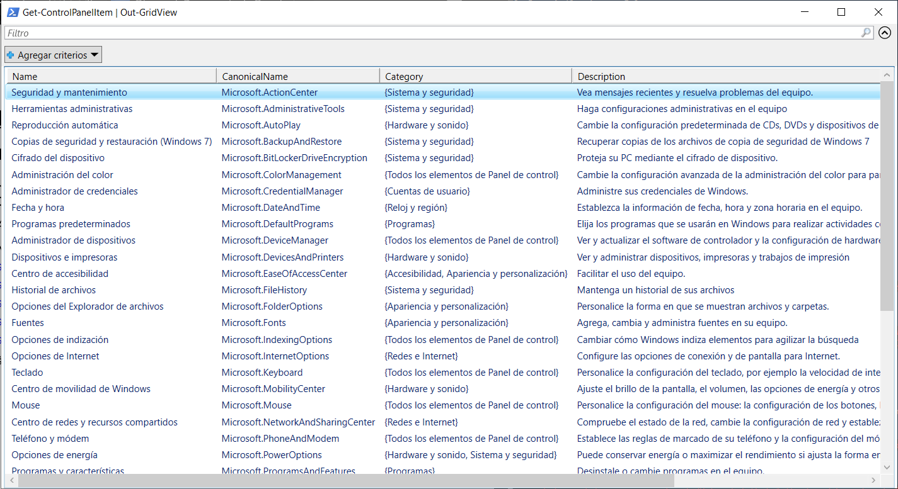

# Sistemas Informáticos

## Ejercicio de clase 3 - Primitive Datatype

### Josep M Castell Colom

## Disclaimer

A pesar de haber realizado `Update-Help` seguimos recibiendo el mensaje de:

```powerhell
Get-Help no encuentra los archivos de Ayuda para este cmdlet en el equipo. Mostrará solo una parte de la Ayuda.
        -- Para descargar e instalar los archivos de Ayuda para el módulo que incluye este cmdlet, use Update-Help.
        -- Para ver en línea el tema de Ayuda de este cmdlet, escriba "Get-Help Get-Help -Online" o
           vaya a https://go.microsoft.com/fwlink/?LinkID=113316.
```

Mensaje de error de `Update-Help`: 

```powershell
Update-Help : No se pudo actualizar la Ayuda para los módulos:
'AppBackgroundTask, Appx, BitLocker, BitsTransfer, CimCmdlets, Defender, DirectAccessClientComponents, Dism,
DnsClient, EventTracingManagement, International, iSCSI, ISE, Kds, Microsoft.PowerShell.Archive,
Microsoft.PowerShell.Core, Microsoft.PowerShell.Diagnostics, Microsoft.PowerShell.Host,
Microsoft.PowerShell.LocalAccounts, Microsoft.PowerShell.Management, Microsoft.PowerShell.ODataUtils,
Microsoft.PowerShell.Security, Microsoft.PowerShell.Utility, Microsoft.WSMan.Management, MMAgent, MsDtc, NetAdapter,
NetConnection, NetEventPacketCapture, NetLbfo, NetNat, NetQos, NetSecurity, NetSwitchTeam, NetTCPIP,
NetworkConnectivityStatus, NetworkSwitchManager, NetworkTransition, PackageManagement, PcsvDevice, PKI, PnpDevice,
PowerShellGet, PrintManagement, ProcessMitigations, Provisioning, PSDesiredStateConfiguration, PSScheduledJob,
PSWorkflow, PSWorkflowUtility, ScheduledTasks, SecureBoot, SmbShare, SmbWitness, StartLayout, Storage, TLS,
TroubleshootingPack, TrustedPlatformModule, VpnClient, Wdac, Whea, WindowsDeveloperLicense, WindowsErrorReporting,
WindowsSearch, WindowsUpdate'
Acceso denegado. El comando no pudo actualizar los temas de Ayuda para los módulos principales de Windows PowerShell o
para los módulos del directorio $pshome\Modules. Para actualizar estos temas de Ayuda, inicie Windows PowerShell con
el comando "Ejecutar como administrador" e intente volver a ejecutar Update-Help.
En línea: 1 Carácter: 1
+ Update-Help
+ ~~~~~~~~~~~
    + CategoryInfo          : InvalidOperation: (:) [Update-Help], Exception
    + FullyQualifiedErrorId : UpdatableHelpSystemRequiresElevation,Microsoft.PowerShell.Commands.UpdateHelpCommand

Update-Help : No se pudo actualizar la Ayuda para los módulos 'ConfigDefender, ConfigDefenderPerformance, PSReadline'
con las referencias culturales de interfaz de usuario {es-ES} : No se puede recuperar el archivo XML HelpInfo para la
referencia cultural de la interfaz de usuario es-ES. Asegúrese de que la propiedad HelpInfoUri del manifiesto del
módulo sea válida o compruebe la conexión de red e intente ejecutar el comando de nuevo.
En línea: 1 Carácter: 1
+ Update-Help
+ ~~~~~~~~~~~
    + CategoryInfo          : ResourceUnavailable: (:) [Update-Help], Exception
    + FullyQualifiedErrorId : UnableToRetrieveHelpInfoXml,Microsoft.PowerShell.Commands.UpdateHelpCommand

Update-Help : No se pudo actualizar la Ayuda para los módulos 'Microsoft.PowerShell.Operation.Validation' con las
referencias culturales de interfaz de usuario {en-US} : Acceso denegado a la ruta de acceso 'C:\Program
Files\WindowsPowerShell\Modules\Microsoft.PowerShell.Operation.Validation\1.0.1\en-US'.
En línea: 1 Carácter: 1
+ Update-Help
+ ~~~~~~~~~~~
    + CategoryInfo          : InvalidOperation: (:) [Update-Help], Exception
    + FullyQualifiedErrorId : UnknownErrorId,Microsoft.PowerShell.Commands.UpdateHelpCommand

```

## Task 1

```powershell
> Get-Help Get-Help

NOMBRE
Get-Help

SINTAXIS
    Get-Help [[-Name] <string>]  [<CommonParameters>]

    Get-Help [[-Name] <string>]  [<CommonParameters>]

    Get-Help [[-Name] <string>]  [<CommonParameters>]

    Get-Help [[-Name] <string>]  [<CommonParameters>]

    Get-Help [[-Name] <string>]  [<CommonParameters>]

    Get-Help [[-Name] <string>]  [<CommonParameters>]                                               
    
ALIAS

  Ninguno                                                                                           

NOTAS
  Get-Help no encuentra los archivos de Ayuda para este cmdlet en el equipo. Mostrará solo una parte de la Ayuda.
        -- Para descargar e instalar los archivos de Ayuda para el módulo que incluye este cmdlet, use Update-Help.
        -- Para ver en línea el tema de Ayuda de este cmdlet, escriba "Get-Help Get-Help -Online" o
           vaya a https://go.microsoft.com/fwlink/?LinkID=113316.


> Get-Help New-Item

NOMBRE
    New-Item

SINTAXIS
    New-Item [-Path] <string[]>  [<CommonParameters>]

    New-Item [[-Path] <string[]>]  [<CommonParameters>]


ALIAS
    ni


NOTAS
    Get-Help no encuentra los archivos de Ayuda para este cmdlet en el equipo. Mostrará solo una parte de la Ayuda.
        -- Para descargar e instalar los archivos de Ayuda para el módulo que incluye este cmdlet, use Update-Help.
        -- Para ver en línea el tema de Ayuda de este cmdlet, escriba "Get-Help New-Item -Online" o
           vaya a https://go.microsoft.com/fwlink/?LinkID=113353.
           

> Get-Help New-Alias

NOMBRE
    New-Alias

SINTAXIS
    New-Alias [-Name] <string> [-Value] <string>  [<CommonParameters>]


ALIAS
    nal


NOTAS
    Get-Help no encuentra los archivos de Ayuda para este cmdlet en el equipo. Mostrará solo una parte de la Ayuda.
        -- Para descargar e instalar los archivos de Ayuda para el módulo que incluye este cmdlet, use Update-Help.
        -- Para ver en línea el tema de Ayuda de este cmdlet, escriba "Get-Help New-Alias -Online" o
           vaya a https://go.microsoft.com/fwlink/?LinkID=113352.


> Get-Help Get-AuthenticodeSignature

NOMBRE
    Get-AuthenticodeSignature

SINTAXIS
    Get-AuthenticodeSignature [-FilePath] <string[]>  [<CommonParameters>]

    Get-AuthenticodeSignature  [<CommonParameters>]

    Get-AuthenticodeSignature  [<CommonParameters>]


ALIAS
    Ninguno


NOTAS
    Get-Help no encuentra los archivos de Ayuda para este cmdlet en el equipo. Mostrará solo una parte de la Ayuda.
        -- Para descargar e instalar los archivos de Ayuda para el módulo que incluye este cmdlet, use Update-Help.
        -- Para ver en línea el tema de Ayuda de este cmdlet, escriba "Get-Help Get-AuthenticodeSignature -Online" o
           vaya a https://go.microsoft.com/fwlink/?LinkID=113307.

> Get-Help Get-ControlPanelItem

NOMBRE
    Get-ControlPanelItem

SINTAXIS
    Get-ControlPanelItem [[-Name] <string[]>]  [<CommonParameters>]

    Get-ControlPanelItem  [<CommonParameters>]


ALIAS
    Ninguno


NOTAS
    Get-Help no encuentra los archivos de Ayuda para este cmdlet en el equipo. Mostrará solo una parte de la Ayuda.
        -- Para descargar e instalar los archivos de Ayuda para el módulo que incluye este cmdlet, use Update-Help.
        -- Para ver en línea el tema de Ayuda de este cmdlet, escriba "Get-Help Get-ControlPanelItem -Online" o
           vaya a https://go.microsoft.com/fwlink/?LinkID=219982.
```

## Task 2

```powershell
> Get-Help Get-Help -Examples

NOMBRE
    Get-Help

ALIAS
    Ninguno


NOTAS
    Get-Help no encuentra los archivos de Ayuda para este cmdlet en el equipo. Mostrará solo una parte de la Ayuda.
        -- Para descargar e instalar los archivos de Ayuda para el módulo que incluye este cmdlet, use Update-Help.
        -- Para ver en línea el tema de Ayuda de este cmdlet, escriba "Get-Help Get-Help -Online" o
           vaya a https://go.microsoft.com/fwlink/?LinkID=113316.


> Get-Help New-Item -Examples

NOMBRE
    New-Item

ALIAS
    ni


NOTAS
    Get-Help no encuentra los archivos de Ayuda para este cmdlet en el equipo. Mostrará solo una parte de la Ayuda.
        -- Para descargar e instalar los archivos de Ayuda para el módulo que incluye este cmdlet, use Update-Help.
        -- Para ver en línea el tema de Ayuda de este cmdlet, escriba "Get-Help New-Item -Online" o
           vaya a https://go.microsoft.com/fwlink/?LinkID=113353.


> Get-Help New-Alias -Examples

NOMBRE
    New-Alias

ALIAS
    nal


NOTAS
    Get-Help no encuentra los archivos de Ayuda para este cmdlet en el equipo. Mostrará solo una parte de la Ayuda.
        -- Para descargar e instalar los archivos de Ayuda para el módulo que incluye este cmdlet, use Update-Help.
        -- Para ver en línea el tema de Ayuda de este cmdlet, escriba "Get-Help New-Alias -Online" o
           vaya a https://go.microsoft.com/fwlink/?LinkID=113352.


> Get-Help Get-AuthenticodeSignature -Examples

NOMBRE
    Get-AuthenticodeSignature

ALIAS
    Ninguno


NOTAS
    Get-Help no encuentra los archivos de Ayuda para este cmdlet en el equipo. Mostrará solo una parte de la Ayuda.
        -- Para descargar e instalar los archivos de Ayuda para el módulo que incluye este cmdlet, use Update-Help.
        -- Para ver en línea el tema de Ayuda de este cmdlet, escriba "Get-Help Get-AuthenticodeSignature -Online" o
           vaya a https://go.microsoft.com/fwlink/?LinkID=113307.


> Get-Help Get-ControlPanelItem -Examples

NOMBRE
    Get-ControlPanelItem

ALIAS
    Ninguno


NOTAS
    Get-Help no encuentra los archivos de Ayuda para este cmdlet en el equipo. Mostrará solo una parte de la Ayuda.
        -- Para descargar e instalar los archivos de Ayuda para el módulo que incluye este cmdlet, use Update-Help.
        -- Para ver en línea el tema de Ayuda de este cmdlet, escriba "Get-Help Get-ControlPanelItem -Online" o
           vaya a https://go.microsoft.com/fwlink/?LinkID=219982.
```

## Task 3

```powershell
> New-Item -Path C:\Maximo\PowerShell\Workshop1\%USERNAME% -ItemType Directory


    Directorio: C:\Maximo\PowerShell\Workshop1


Mode                 LastWriteTime         Length Name
----                 -------------         ------ ----
d-----        29/03/2022     19:51                %USERNAME%


> New-Item -Path C:\Maximo\PowerShell\Workshop1\%USERNAME%\ -Name TestFile.txt -ItemType File


    Directorio: C:\Maximo\PowerShell\Workshop1\%USERNAME%


Mode                 LastWriteTime         Length Name
----                 -------------         ------ ----
-a----        29/03/2022     19:54              0 TestFile.txt
```

## Task 4

```powershell
> Add-Content -Path C:\Maximo\PowerShell\Workshop1\%USERNAME%\TestFile.txt -Value True
>

> Add-Content -Path C:\Maximo\PowerShell\Workshop1\%USERNAME%\TestFile.txt -Value "Hello"
>

> Add-Content -Path C:\Maximo\PowerShell\Workshop1\%USERNAME%\TestFile.txt -Value 42
>
```

## Task 5

```powershell
> Get-Content -Path C:\Maximo\PowerShell\Workshop1\%USERNAME%\TestFile.txt | Get-Member


   TypeName: System.String

Name             MemberType            Definition
----             ----------            ----------
Clone            Method                System.Object Clone(), System.Object ICloneable.Clone()
CompareTo        Method                int CompareTo(System.Object value), int CompareTo(string strB), int IComparab...
Contains         Method                bool Contains(string value)
CopyTo           Method                void CopyTo(int sourceIndex, char[] destination, int destinationIndex, int co...
EndsWith         Method                bool EndsWith(string value), bool EndsWith(string value, System.StringCompari...
Equals           Method                bool Equals(System.Object obj), bool Equals(string value), bool Equals(string...
GetEnumerator    Method                System.CharEnumerator GetEnumerator(), System.Collections.IEnumerator IEnumer...
GetHashCode      Method                int GetHashCode()
GetType          Method                type GetType()
GetTypeCode      Method                System.TypeCode GetTypeCode(), System.TypeCode IConvertible.GetTypeCode()
IndexOf          Method                int IndexOf(char value), int IndexOf(char value, int startIndex), int IndexOf...
IndexOfAny       Method                int IndexOfAny(char[] anyOf), int IndexOfAny(char[] anyOf, int startIndex), i...
Insert           Method                string Insert(int startIndex, string value)
IsNormalized     Method                bool IsNormalized(), bool IsNormalized(System.Text.NormalizationForm normaliz...
LastIndexOf      Method                int LastIndexOf(char value), int LastIndexOf(char value, int startIndex), int...
LastIndexOfAny   Method                int LastIndexOfAny(char[] anyOf), int LastIndexOfAny(char[] anyOf, int startI...
Normalize        Method                string Normalize(), string Normalize(System.Text.NormalizationForm normalizat...
PadLeft          Method                string PadLeft(int totalWidth), string PadLeft(int totalWidth, char paddingChar)
PadRight         Method                string PadRight(int totalWidth), string PadRight(int totalWidth, char padding...
Remove           Method                string Remove(int startIndex, int count), string Remove(int startIndex)
Replace          Method                string Replace(char oldChar, char newChar), string Replace(string oldValue, s...
Split            Method                string[] Split(Params char[] separator), string[] Split(char[] separator, int...
StartsWith       Method                bool StartsWith(string value), bool StartsWith(string value, System.StringCom...
Substring        Method                string Substring(int startIndex), string Substring(int startIndex, int length)
ToBoolean        Method                bool IConvertible.ToBoolean(System.IFormatProvider provider)
ToByte           Method                byte IConvertible.ToByte(System.IFormatProvider provider)
ToChar           Method                char IConvertible.ToChar(System.IFormatProvider provider)
ToCharArray      Method                char[] ToCharArray(), char[] ToCharArray(int startIndex, int length)
ToDateTime       Method                datetime IConvertible.ToDateTime(System.IFormatProvider provider)
ToDecimal        Method                decimal IConvertible.ToDecimal(System.IFormatProvider provider)
ToDouble         Method                double IConvertible.ToDouble(System.IFormatProvider provider)
ToInt16          Method                int16 IConvertible.ToInt16(System.IFormatProvider provider)
ToInt32          Method                int IConvertible.ToInt32(System.IFormatProvider provider)
ToInt64          Method                long IConvertible.ToInt64(System.IFormatProvider provider)
ToLower          Method                string ToLower(), string ToLower(cultureinfo culture)
ToLowerInvariant Method                string ToLowerInvariant()
ToSByte          Method                sbyte IConvertible.ToSByte(System.IFormatProvider provider)
ToSingle         Method                float IConvertible.ToSingle(System.IFormatProvider provider)
ToString         Method                string ToString(), string ToString(System.IFormatProvider provider), string I...
ToType           Method                System.Object IConvertible.ToType(type conversionType, System.IFormatProvider...
ToUInt16         Method                uint16 IConvertible.ToUInt16(System.IFormatProvider provider)
ToUInt32         Method                uint32 IConvertible.ToUInt32(System.IFormatProvider provider)
ToUInt64         Method                uint64 IConvertible.ToUInt64(System.IFormatProvider provider)
ToUpper          Method                string ToUpper(), string ToUpper(cultureinfo culture)
ToUpperInvariant Method                string ToUpperInvariant()
Trim             Method                string Trim(Params char[] trimChars), string Trim()
TrimEnd          Method                string TrimEnd(Params char[] trimChars)
TrimStart        Method                string TrimStart(Params char[] trimChars)
PSChildName      NoteProperty          string PSChildName=TestFile.txt
PSDrive          NoteProperty          PSDriveInfo PSDrive=C
PSParentPath     NoteProperty          string PSParentPath=C:\Maximo\PowerShell\Workshop1\%USERNAME%
PSPath           NoteProperty          string PSPath=C:\Maximo\PowerShell\Workshop1\%USERNAME%\TestFile.txt
PSProvider       NoteProperty          ProviderInfo PSProvider=Microsoft.PowerShell.Core\FileSystem
ReadCount        NoteProperty          long ReadCount=1
Chars            ParameterizedProperty char Chars(int index) {get;}
Length           Property              int Length {get;}
```

## Task 6

```powershell
> Set-Content -Path C:\Maximo\PowerShell\Workshop1\%USERNAME%\TestFile.txt -Value "Booooo"
>
```

## Task 7

```powershell
> Get-Service | Format-List


Name                : AarSvc_995dfb
DisplayName         : Agent Activation Runtime_995dfb
Status              : Running
DependentServices   : {}
ServicesDependedOn  : {}
CanPauseAndContinue : False
CanShutdown         : False
CanStop             : True
ServiceType         : 240

Name                : AJRouter
DisplayName         : Servicio de enrutador de AllJoyn
Status              : Stopped
DependentServices   : {}
ServicesDependedOn  : {}
CanPauseAndContinue : False
CanShutdown         : False
CanStop             : False
ServiceType         : Win32ShareProcess

Name                : ALG
DisplayName         : Servicio de puerta de enlace de nivel de aplicación
Status              : Stopped
DependentServices   : {}
ServicesDependedOn  : {}
CanPauseAndContinue : False
CanShutdown         : False
CanStop             : False
ServiceType         : Win32OwnProcess

Name                : AppIDSvc
DisplayName         : Identidad de aplicación
Status              : Stopped
DependentServices   : {applockerfltr}
ServicesDependedOn  : {RpcSs, CryptSvc, AppID}
CanPauseAndContinue : False
CanShutdown         : False
CanStop             : False
ServiceType         : Win32ShareProcess

Name                : Appinfo
DisplayName         : Información de la aplicación
Status              : Running
DependentServices   : {}
ServicesDependedOn  : {RpcSs, ProfSvc}
CanPauseAndContinue : False
CanShutdown         : False
CanStop             : True
ServiceType         : Win32OwnProcess, Win32ShareProcess

Name                : AppReadiness
DisplayName         : Preparación de aplicaciones
Status              : Stopped
DependentServices   : {}
ServicesDependedOn  : {}
CanPauseAndContinue : False
CanShutdown         : False
CanStop             : False
ServiceType         : Win32OwnProcess, Win32ShareProcess

Name                : AppXSvc
DisplayName         : Servicio de implementación de AppX (AppXSVC)
Status              : Running
DependentServices   : {}
ServicesDependedOn  : {rpcss, staterepository}
CanPauseAndContinue : False
CanShutdown         : True
CanStop             : True
ServiceType         : Win32OwnProcess, Win32ShareProcess

Name                : AudioEndpointBuilder
DisplayName         : Compilador de extremo de audio de Windows
Status              : Running
DependentServices   : {AarSvc_995dfb, AarSvc, Audiosrv}
ServicesDependedOn  : {}
CanPauseAndContinue : False
CanShutdown         : False
CanStop             : True
ServiceType         : Win32OwnProcess, Win32ShareProcess

Name                : Audiosrv
DisplayName         : Audio de Windows
Status              : Running
DependentServices   : {AarSvc_995dfb, AarSvc}
ServicesDependedOn  : {AudioEndpointBuilder, RpcSs}
CanPauseAndContinue : False
CanShutdown         : False
CanStop             : True
ServiceType         : Win32OwnProcess

Name                : autotimesvc
DisplayName         : Hora de la red de telefonía móvil
Status              : Stopped
DependentServices   : {}
ServicesDependedOn  : {rpcss}
CanPauseAndContinue : False
CanShutdown         : False
CanStop             : False
ServiceType         : Win32OwnProcess

Name                : AxInstSV
DisplayName         : Instalador de ActiveX (AxInstSV)
Status              : Stopped
DependentServices   : {}
ServicesDependedOn  : {rpcss}
CanPauseAndContinue : False
CanShutdown         : False
CanStop             : False
ServiceType         : Win32ShareProcess

Name                : BcastDVRUserService_995dfb
DisplayName         : Servicio de usuario de difusión y GameDVR_995dfb
Status              : Stopped
DependentServices   : {}
ServicesDependedOn  : {}
CanPauseAndContinue : False
CanShutdown         : False
CanStop             : False
ServiceType         : 224

Name                : BDESVC
DisplayName         : Servicio Cifrado de unidad BitLocker
Status              : Running
DependentServices   : {}
ServicesDependedOn  : {}
CanPauseAndContinue : False
CanShutdown         : False
CanStop             : True
ServiceType         : Win32OwnProcess, Win32ShareProcess

Name                : BFE
DisplayName         : Motor de filtrado de base
Status              : Running
DependentServices   :
ServicesDependedOn  : {RpcSs}
CanPauseAndContinue : False
CanShutdown         : False
CanStop             : True
ServiceType         : Win32ShareProcess

Name                : BITS
DisplayName         : Servicio de transferencia inteligente en segundo plano (BITS)
Status              : Stopped
DependentServices   : {}
ServicesDependedOn  : {RpcSs}
CanPauseAndContinue : False
CanShutdown         : False
CanStop             : False
ServiceType         : Win32ShareProcess

Name                : BluetoothUserService_995dfb
DisplayName         : Servicio de soporte técnico de usuario de Bluetooth_995dfb
Status              : Stopped
DependentServices   : {}
ServicesDependedOn  : {}
CanPauseAndContinue : False
CanShutdown         : False
CanStop             : False
ServiceType         : 224

Name                : BrokerInfrastructure
DisplayName         : Servicio de infraestructura de tareas en segundo plano
Status              : Running
DependentServices   :
ServicesDependedOn  : {DcomLaunch, RpcSs, RpcEptMapper}
CanPauseAndContinue : False
CanShutdown         : False
CanStop             : False
ServiceType         : Win32ShareProcess

Name                : Browser
DisplayName         : Examinador de equipos
Status              : Stopped
DependentServices   : {}
ServicesDependedOn  : {LanmanServer, LanmanWorkstation}
CanPauseAndContinue : False
CanShutdown         : False
CanStop             : False
ServiceType         : Win32OwnProcess, Win32ShareProcess

Name                : BTAGService
DisplayName         : Servicio de puerta de enlace de audio de Bluetooth
Status              : Stopped
DependentServices   : {}
ServicesDependedOn  : {rpcss}
CanPauseAndContinue : False
CanShutdown         : False
CanStop             : False
ServiceType         : Win32ShareProcess

Name                : BthAvctpSvc
DisplayName         : Servicio AVCTP
Status              : Running
DependentServices   : {}
ServicesDependedOn  : {rpcss}
CanPauseAndContinue : False
CanShutdown         : False
CanStop             : True
ServiceType         : Win32OwnProcess, Win32ShareProcess

Name                : bthserv
DisplayName         : Servicio de compatibilidad con Bluetooth
Status              : Stopped
DependentServices   : {BluetoothUserService_995dfb, BluetoothUserService}
ServicesDependedOn  : {}
CanPauseAndContinue : False
CanShutdown         : False
CanStop             : False
ServiceType         : Win32ShareProcess

Name                : camsvc
DisplayName         : Servicio Administrador de funcionalidad de acceso
Status              : Running
DependentServices   : {}
ServicesDependedOn  : {}
CanPauseAndContinue : False
CanShutdown         : True
CanStop             : True
ServiceType         : Win32OwnProcess, Win32ShareProcess

Name                : CaptureService_995dfb
DisplayName         : CaptureService_995dfb
Status              : Stopped
DependentServices   : {}
ServicesDependedOn  : {}
CanPauseAndContinue : False
CanShutdown         : False
CanStop             : False
ServiceType         : 224

Name                : cbdhsvc_995dfb
DisplayName         : Servicio de usuario del portapapeles_995dfb
Status              : Running
DependentServices   : {}
ServicesDependedOn  : {}
CanPauseAndContinue : False
CanShutdown         : False
CanStop             : True
ServiceType         : 240

Name                : CDPSvc
DisplayName         : Servicio de plataforma de dispositivos conectados
Status              : Running
DependentServices   : {}
ServicesDependedOn  : {Tcpip, ncbservice, RpcSS}
CanPauseAndContinue : False
CanShutdown         : False
CanStop             : True
ServiceType         : Win32OwnProcess, Win32ShareProcess

Name                : CDPUserSvc_995dfb
DisplayName         : Servicio de usuario de plataforma de dispositivos conectados_995dfb
Status              : Running
DependentServices   : {}
ServicesDependedOn  : {}
CanPauseAndContinue : False
CanShutdown         : False
CanStop             : True
ServiceType         : 240

Name                : CertPropSvc
DisplayName         : Propagación de certificados
Status              : Stopped
DependentServices   : {}
ServicesDependedOn  : {RpcSs}
CanPauseAndContinue : False
CanShutdown         : False
CanStop             : False
ServiceType         : Win32ShareProcess

Name                : ClickToRunSvc
DisplayName         : Servicio Hacer clic y ejecutar de Microsoft Office
Status              : Running
DependentServices   : {}
ServicesDependedOn  : {}
CanPauseAndContinue : False
CanShutdown         : True
CanStop             : True
ServiceType         : Win32OwnProcess

Name                : ClipSVC
DisplayName         : Servicio de licencia de cliente (ClipSVC)
Status              : Stopped
DependentServices   : {}
ServicesDependedOn  : {rpcss}
CanPauseAndContinue : False
CanShutdown         : False
CanStop             : False
ServiceType         : Win32OwnProcess, Win32ShareProcess

Name                : COMSysApp
DisplayName         : Aplicación del sistema COM+
Status              : Stopped
DependentServices   : {}
ServicesDependedOn  : {EventSystem, SENS, RpcSs}
CanPauseAndContinue : False
CanShutdown         : False
CanStop             : False
ServiceType         : Win32OwnProcess

Name                : ConsentUxUserSvc_995dfb
DisplayName         : ConsentUX_995dfb
Status              : Stopped
DependentServices   : {}
ServicesDependedOn  : {}
CanPauseAndContinue : False
CanShutdown         : False
CanStop             : False
ServiceType         : 224

Name                : CoreMessagingRegistrar
DisplayName         : CoreMessaging
Status              : Running
DependentServices   : {}
ServicesDependedOn  : {rpcss}
CanPauseAndContinue : False
CanShutdown         : False
CanStop             : False
ServiceType         : Win32ShareProcess

Name                : cplspcon
DisplayName         : Intel(R) Content Protection HDCP Service
Status              : Running
DependentServices   : {}
ServicesDependedOn  : {}
CanPauseAndContinue : False
CanShutdown         : False
CanStop             : True
ServiceType         : Win32OwnProcess

Name                : CredentialEnrollmentManagerUserSvc_995dfb
DisplayName         : CredentialEnrollmentManagerUserSvc_995dfb
Status              : Stopped
DependentServices   : {}
ServicesDependedOn  : {}
CanPauseAndContinue : False
CanShutdown         : False
CanStop             : False
ServiceType         : 208

Name                : CryptSvc
DisplayName         : Servicios de cifrado
Status              : Running
DependentServices   : {applockerfltr, AppIDSvc}
ServicesDependedOn  : {RpcSs}
CanPauseAndContinue : False
CanShutdown         : True
CanStop             : True
ServiceType         : Win32OwnProcess, Win32ShareProcess

Name                : DcomLaunch
DisplayName         : Iniciador de procesos de servidor DCOM
Status              : Running
DependentServices   :
ServicesDependedOn  : {}
CanPauseAndContinue : False
CanShutdown         : False
CanStop             : False
ServiceType         : Win32ShareProcess

Name                : defragsvc
DisplayName         : Optimizar unidades
Status              : Stopped
DependentServices   : {}
ServicesDependedOn  : {RPCSS}
CanPauseAndContinue : False
CanShutdown         : False
CanStop             : False
ServiceType         : Win32OwnProcess

Name                : DeviceAssociationBrokerSvc_995dfb
DisplayName         : DeviceAssociationBroker_995dfb
Status              : Stopped
DependentServices   : {}
ServicesDependedOn  : {}
CanPauseAndContinue : False
CanShutdown         : False
CanStop             : False
ServiceType         : 224

Name                : DeviceAssociationService
DisplayName         : Servicio de asociación de dispositivos
Status              : Running
DependentServices   : {}
ServicesDependedOn  : {}
CanPauseAndContinue : False
CanShutdown         : True
CanStop             : True
ServiceType         : Win32OwnProcess, Win32ShareProcess

Name                : DeviceInstall
DisplayName         : Servicio de instalación de dispositivos
Status              : Running
DependentServices   : {}
ServicesDependedOn  : {}
CanPauseAndContinue : False
CanShutdown         : False
CanStop             : True
ServiceType         : Win32OwnProcess, Win32ShareProcess

Name                : DevicePickerUserSvc_995dfb
DisplayName         : DevicePicker_995dfb
Status              : Stopped
DependentServices   : {}
ServicesDependedOn  : {}
CanPauseAndContinue : False
CanShutdown         : False
CanStop             : False
ServiceType         : 224

Name                : DevicesFlowUserSvc_995dfb
DisplayName         : DevicesFlow_995dfb
Status              : Stopped
DependentServices   : {}
ServicesDependedOn  : {}
CanPauseAndContinue : False
CanShutdown         : False
CanStop             : False
ServiceType         : 224

Name                : DevQueryBroker
DisplayName         : Agente de detección en segundo plano de DevQuery
Status              : Stopped
DependentServices   : {}
ServicesDependedOn  : {}
CanPauseAndContinue : False
CanShutdown         : False
CanStop             : False
ServiceType         : Win32ShareProcess

Name                : Dhcp
DisplayName         : Cliente DHCP
Status              : Running
DependentServices   : {NcaSvc, jhi_service, iphlpsvc, WinHttpAutoProxySvc...}
ServicesDependedOn  : {Afd, NSI}
CanPauseAndContinue : False
CanShutdown         : True
CanStop             : True
ServiceType         : Win32OwnProcess, Win32ShareProcess

Name                : diagnosticshub.standardcollector.service
DisplayName         : Servicio Recopilador estándar del concentrador de diagnósticos de Microsoft (R)
Status              : Stopped
DependentServices   : {}
ServicesDependedOn  : {}
CanPauseAndContinue : False
CanShutdown         : False
CanStop             : False
ServiceType         : Win32OwnProcess

Name                : diagsvc
DisplayName         : Diagnostic Execution Service
Status              : Stopped
DependentServices   : {}
ServicesDependedOn  : {RpcSs}
CanPauseAndContinue : False
CanShutdown         : False
CanStop             : False
ServiceType         : Win32ShareProcess

Name                : DiagTrack
DisplayName         : Experiencias del usuario y telemetría asociadas
Status              : Running
DependentServices   : {}
ServicesDependedOn  : {RpcSs}
CanPauseAndContinue : False
CanShutdown         : True
CanStop             : True
ServiceType         : Win32OwnProcess

Name                : DispBrokerDesktopSvc
DisplayName         : Mostrar el servicio de directivas
Status              : Running
DependentServices   : {}
ServicesDependedOn  : {RpcSS}
CanPauseAndContinue : False
CanShutdown         : False
CanStop             : True
ServiceType         : Win32OwnProcess, Win32ShareProcess

Name                : DisplayEnhancementService
DisplayName         : Servicio de mejora de visualización
Status              : Running
DependentServices   : {}
ServicesDependedOn  : {}
CanPauseAndContinue : False
CanShutdown         : False
CanStop             : True
ServiceType         : Win32OwnProcess, Win32ShareProcess

Name                : DmEnrollmentSvc
DisplayName         : Servicio de inscripción de administración de dispositivos
Status              : Stopped
DependentServices   : {}
ServicesDependedOn  : {rpcss}
CanPauseAndContinue : False
CanShutdown         : False
CanStop             : False
ServiceType         : Win32OwnProcess

Name                : dmwappushservice
DisplayName         : Servicio de enrutamiento de mensajes de inserción del Protocolo de aplicación inalámbrica (WAP)
                      de administración de dispositivos
Status              : Stopped
DependentServices   : {}
ServicesDependedOn  : {rpcss}
CanPauseAndContinue : False
CanShutdown         : False
CanStop             : False
ServiceType         : Win32OwnProcess, Win32ShareProcess

Name                : Dnscache
DisplayName         : Cliente DNS
Status              : Running
DependentServices   : {RemoteAccess, RasMan, NcaSvc}
ServicesDependedOn  : {nsi, Afd}
CanPauseAndContinue : False
CanShutdown         : False
CanStop             : False
ServiceType         : Win32OwnProcess, Win32ShareProcess

Name                : DolbyDAXAPI
DisplayName         : Dolby DAX API Service
Status              : Running
DependentServices   : {}
ServicesDependedOn  : {}
CanPauseAndContinue : False
CanShutdown         : True
CanStop             : True
ServiceType         : Win32OwnProcess

Name                : DoSvc
DisplayName         : Optimización de distribución
Status              : Stopped
DependentServices   : {}
ServicesDependedOn  : {rpcss}
CanPauseAndContinue : False
CanShutdown         : False
CanStop             : False
ServiceType         : Win32OwnProcess, Win32ShareProcess

Name                : dot3svc
DisplayName         : Configuración automática de redes cableadas
Status              : Stopped
DependentServices   : {}
ServicesDependedOn  : {RpcSs, Eaphost, Ndisuio}
CanPauseAndContinue : False
CanShutdown         : False
CanStop             : False
ServiceType         : Win32ShareProcess

Name                : DPS
DisplayName         : Servicio de directivas de diagnóstico
Status              : Running
DependentServices   : {}
ServicesDependedOn  : {}
CanPauseAndContinue : False
CanShutdown         : True
CanStop             : True
ServiceType         : Win32OwnProcess, Win32ShareProcess

Name                : DsmSvc
DisplayName         : Administrador de configuración de dispositivos
Status              : Stopped
DependentServices   : {}
ServicesDependedOn  : {RpcSs}
CanPauseAndContinue : False
CanShutdown         : False
CanStop             : False
ServiceType         : Win32ShareProcess

Name                : DsSvc
DisplayName         : Servicio de uso compartido de datos
Status              : Stopped
DependentServices   : {}
ServicesDependedOn  : {}
CanPauseAndContinue : False
CanShutdown         : False
CanStop             : False
ServiceType         : Win32ShareProcess

Name                : DusmSvc
DisplayName         : Uso de datos
Status              : Running
DependentServices   : {}
ServicesDependedOn  : {RpcSs}
CanPauseAndContinue : False
CanShutdown         : False
CanStop             : True
ServiceType         : Win32OwnProcess

Name                : Eaphost
DisplayName         : Protocolo de autenticación extensible
Status              : Running
DependentServices   : {dot3svc}
ServicesDependedOn  : {RPCSS, KeyIso}
CanPauseAndContinue : False
CanShutdown         : True
CanStop             : True
ServiceType         : Win32OwnProcess, Win32ShareProcess

Name                : edgeupdate
DisplayName         : Microsoft Edge Update Service (edgeupdate)
Status              : Stopped
DependentServices   : {}
ServicesDependedOn  : {RPCSS}
CanPauseAndContinue : False
CanShutdown         : False
CanStop             : False
ServiceType         : Win32OwnProcess

Name                : edgeupdatem
DisplayName         : Microsoft Edge Update Service (edgeupdatem)
Status              : Stopped
DependentServices   : {}
ServicesDependedOn  : {RPCSS}
CanPauseAndContinue : False
CanShutdown         : False
CanStop             : False
ServiceType         : Win32OwnProcess

Name                : EFS
DisplayName         : Sistema de cifrado de archivos (EFS)
Status              : Stopped
DependentServices   : {}
ServicesDependedOn  : {RPCSS}
CanPauseAndContinue : False
CanShutdown         : False
CanStop             : False
ServiceType         : Win32ShareProcess

Name                : ElevocService
DisplayName         : Elevoc Control Service
Status              : Running
DependentServices   : {}
ServicesDependedOn  : {}
CanPauseAndContinue : False
CanShutdown         : True
CanStop             : True
ServiceType         : Win32OwnProcess

Name                : embeddedmode
DisplayName         : Modo insertado
Status              : Stopped
DependentServices   : {}
ServicesDependedOn  : {BrokerInfrastructure}
CanPauseAndContinue : False
CanShutdown         : False
CanStop             : False
ServiceType         : Win32ShareProcess

Name                : EntAppSvc
DisplayName         : Servicio de administración de aplicaciones de empresa
Status              : Stopped
DependentServices   : {}
ServicesDependedOn  : {rpcss}
CanPauseAndContinue : False
CanShutdown         : False
CanStop             : False
ServiceType         : Win32ShareProcess

Name                : EpicOnlineServices
DisplayName         : Epic Online Services
Status              : Stopped
DependentServices   : {}
ServicesDependedOn  : {}
CanPauseAndContinue : False
CanShutdown         : False
CanStop             : False
ServiceType         : Win32OwnProcess

Name                : esifsvc
DisplayName         : Intel(R) Dynamic Tuning service
Status              : Running
DependentServices   : {}
ServicesDependedOn  : {}
CanPauseAndContinue : True
CanShutdown         : False
CanStop             : True
ServiceType         : Win32OwnProcess

Name                : EventLog
DisplayName         : Registro de eventos de Windows
Status              : Running
DependentServices   : {Wecsvc, uhssvc, NcdAutoSetup, netprofm...}
ServicesDependedOn  : {}
CanPauseAndContinue : False
CanShutdown         : True
CanStop             : True
ServiceType         : Win32OwnProcess, Win32ShareProcess

Name                : EventSystem
DisplayName         : Sistema de eventos COM+
Status              : Running
DependentServices   : {igfxCUIService2.0.0.0, COMSysApp, SENS}
ServicesDependedOn  : {rpcss}
CanPauseAndContinue : False
CanShutdown         : False
CanStop             : True
ServiceType         : Win32OwnProcess, Win32ShareProcess

Name                : Fax
DisplayName         : Fax
Status              : Stopped
DependentServices   : {}
ServicesDependedOn  : {RpcSs, TapiSrv, Spooler}
CanPauseAndContinue : False
CanShutdown         : False
CanStop             : False
ServiceType         : Win32OwnProcess

Name                : fdPHost
DisplayName         : Host de proveedor de detección de función
Status              : Running
DependentServices   : {FDResPub}
ServicesDependedOn  : {RpcSs, http}
CanPauseAndContinue : False
CanShutdown         : False
CanStop             : True
ServiceType         : Win32OwnProcess, Win32ShareProcess

Name                : FDResPub
DisplayName         : Publicación de recurso de detección de función
Status              : Running
DependentServices   : {}
ServicesDependedOn  : {http, fdphost, RpcSs}
CanPauseAndContinue : False
CanShutdown         : True
CanStop             : True
ServiceType         : Win32OwnProcess, Win32ShareProcess

Name                : fhsvc
DisplayName         : Servicio de historial de archivos
Status              : Stopped
DependentServices   : {}
ServicesDependedOn  : {RpcSs}
CanPauseAndContinue : False
CanShutdown         : False
CanStop             : False
ServiceType         : Win32ShareProcess

Name                : FontCache
DisplayName         : Servicio de caché de fuentes de Windows
Status              : Running
DependentServices   : {}
ServicesDependedOn  : {}
CanPauseAndContinue : False
CanShutdown         : True
CanStop             : True
ServiceType         : Win32OwnProcess, Win32ShareProcess

Name                : FontCache3.0.0.0
DisplayName         : Windows Presentation Foundation Font Cache 3.0.0.0
Status              : Running
DependentServices   : {}
ServicesDependedOn  : {}
CanPauseAndContinue : False
CanShutdown         : True
CanStop             : True
ServiceType         : Win32OwnProcess

Name                : FrameServer
DisplayName         : Servicio FrameServer de la Cámara de Windows
Status              : Stopped
DependentServices   : {}
ServicesDependedOn  : {rpcss}
CanPauseAndContinue : False
CanShutdown         : False
CanStop             : False
ServiceType         : Win32OwnProcess, Win32ShareProcess

Name                : GamingServices
DisplayName         : Gaming Services
Status              : Running
DependentServices   : {}
ServicesDependedOn  : {staterepository}
CanPauseAndContinue : False
CanShutdown         : True
CanStop             : True
ServiceType         : 528

Name                : GamingServicesNet
DisplayName         : Gaming Services
Status              : Running
DependentServices   : {}
ServicesDependedOn  : {staterepository}
CanPauseAndContinue : False
CanShutdown         : False
CanStop             : True
ServiceType         : 528

Name                : gpsvc
DisplayName         : Cliente de directiva de grupo
Status              : Stopped
DependentServices   : {}
ServicesDependedOn  : {RPCSS, Mup}
CanPauseAndContinue : False
CanShutdown         : False
CanStop             : False
ServiceType         : Win32OwnProcess, Win32ShareProcess

Name                : GraphicsPerfSvc
DisplayName         : GraphicsPerfSvc
Status              : Stopped
DependentServices   : {}
ServicesDependedOn  : {}
CanPauseAndContinue : False
CanShutdown         : False
CanStop             : False
ServiceType         : Win32ShareProcess

Name                : hidserv
DisplayName         : Servicio de dispositivo de interfaz humana
Status              : Stopped
DependentServices   : {}
ServicesDependedOn  : {}
CanPauseAndContinue : False
CanShutdown         : False
CanStop             : False
ServiceType         : Win32ShareProcess

Name                : HvHost
DisplayName         : Servicio de host HV
Status              : Stopped
DependentServices   : {}
ServicesDependedOn  : {hvservice}
CanPauseAndContinue : False
CanShutdown         : False
CanStop             : False
ServiceType         : Win32ShareProcess

Name                : iaStorAfsService
DisplayName         : Intel(R) Optane(TM) Memory Service
Status              : Stopped
DependentServices   : {}
ServicesDependedOn  : {iaStorAfs}
CanPauseAndContinue : False
CanShutdown         : False
CanStop             : False
ServiceType         : Win32OwnProcess

Name                : icssvc
DisplayName         : Servicio de zona con cobertura inalámbrica móvil de Windows
Status              : Stopped
DependentServices   : {}
ServicesDependedOn  : {RpcSs, wcmsvc}
CanPauseAndContinue : False
CanShutdown         : False
CanStop             : False
ServiceType         : Win32ShareProcess

Name                : igccservice
DisplayName         : Intel(R) Graphics Command Center Service
Status              : Running
DependentServices   : {}
ServicesDependedOn  : {}
CanPauseAndContinue : True
CanShutdown         : True
CanStop             : True
ServiceType         : Win32OwnProcess

Name                : igfxCUIService2.0.0.0
DisplayName         : Intel(R) HD Graphics Control Panel Service
Status              : Running
DependentServices   : {}
ServicesDependedOn  : {SENS}
CanPauseAndContinue : False
CanShutdown         : False
CanStop             : True
ServiceType         : Win32OwnProcess

Name                : IKEEXT
DisplayName         : Módulos de creación de claves de IPsec para IKE y AuthIP
Status              : Stopped
DependentServices   : {XboxNetApiSvc}
ServicesDependedOn  : {nsi, BFE}
CanPauseAndContinue : False
CanShutdown         : False
CanStop             : False
ServiceType         : Win32ShareProcess

Name                : ImControllerService
DisplayName         : System Interface Foundation Service
Status              : Running
DependentServices   : {}
ServicesDependedOn  : {}
CanPauseAndContinue : False
CanShutdown         : True
CanStop             : True
ServiceType         : Win32OwnProcess

Name                : InstallService
DisplayName         : Servicio de instalación de Microsoft Store
Status              : Running
DependentServices   : {}
ServicesDependedOn  : {rpcss}
CanPauseAndContinue : False
CanShutdown         : False
CanStop             : True
ServiceType         : Win32OwnProcess

Name                : Intel(R) Capability Licensing Service TCP IP Interface
DisplayName         : Intel(R) Capability Licensing Service TCP IP Interface
Status              : Stopped
DependentServices   : {}
ServicesDependedOn  : {}
CanPauseAndContinue : False
CanShutdown         : False
CanStop             : False
ServiceType         : Win32OwnProcess

Name                : Intel(R) TPM Provisioning Service
DisplayName         : Intel(R) TPM Provisioning Service
Status              : Stopped
DependentServices   : {}
ServicesDependedOn  : {}
CanPauseAndContinue : False
CanShutdown         : False
CanStop             : False
ServiceType         : Win32OwnProcess

Name                : IntelAudioService
DisplayName         : Intel(R) Audio Service
Status              : Stopped
DependentServices   : {}
ServicesDependedOn  : {}
CanPauseAndContinue : False
CanShutdown         : False
CanStop             : False
ServiceType         : Win32OwnProcess

Name                : iphlpsvc
DisplayName         : Aplicación auxiliar IP
Status              : Running
DependentServices   : {NcaSvc, jhi_service}
ServicesDependedOn  : {WinHttpAutoProxySvc, winmgmt, nsi, RpcSS...}
CanPauseAndContinue : False
CanShutdown         : False
CanStop             : True
ServiceType         : Win32OwnProcess, Win32ShareProcess

Name                : IpxlatCfgSvc
DisplayName         : Servicio de configuración de traslación de IP
Status              : Stopped
DependentServices   : {}
ServicesDependedOn  : {nsi}
CanPauseAndContinue : False
CanShutdown         : False
CanStop             : False
ServiceType         : Win32ShareProcess

Name                : jhi_service
DisplayName         : Intel(R) Dynamic Application Loader Host Interface Service
Status              : Running
DependentServices   : {}
ServicesDependedOn  : {TCPIP, iphlpsvc}
CanPauseAndContinue : False
CanShutdown         : False
CanStop             : True
ServiceType         : Win32OwnProcess

Name                : KeyIso
DisplayName         : Aislamiento de claves CNG
Status              : Running
DependentServices   : {XboxNetApiSvc, dot3svc, Eaphost}
ServicesDependedOn  : {RpcSs}
CanPauseAndContinue : False
CanShutdown         : False
CanStop             : True
ServiceType         : Win32ShareProcess

Name                : KtmRm
DisplayName         : KTMRM para DTC (Coordinador de transacciones distribuidas)
Status              : Stopped
DependentServices   : {}
ServicesDependedOn  : {RPCSS, SamSS}
CanPauseAndContinue : False
CanShutdown         : False
CanStop             : False
ServiceType         : Win32ShareProcess

Name                : LanmanServer
DisplayName         : Servidor
Status              : Running
DependentServices   : {Browser}
ServicesDependedOn  : {SamSS, Srv2}
CanPauseAndContinue : False
CanShutdown         : False
CanStop             : True
ServiceType         : Win32OwnProcess, Win32ShareProcess

Name                : LanmanWorkstation
DisplayName         : Estación de trabajo
Status              : Running
DependentServices   : {SessionEnv, Netlogon, Browser}
ServicesDependedOn  : {NSI, MRxSmb20, Bowser}
CanPauseAndContinue : True
CanShutdown         : False
CanStop             : True
ServiceType         : Win32OwnProcess, Win32ShareProcess

Name                : LenovoFnAndFunctionKeys
DisplayName         : Lenovo Fn and function keys service
Status              : Running
DependentServices   : {}
ServicesDependedOn  : {}
CanPauseAndContinue : False
CanShutdown         : True
CanStop             : True
ServiceType         : Win32OwnProcess

Name                : LenovoVantageService
DisplayName         : LenovoVantageService
Status              : Running
DependentServices   : {}
ServicesDependedOn  : {}
CanPauseAndContinue : False
CanShutdown         : True
CanStop             : True
ServiceType         : Win32OwnProcess

Name                : lfsvc
DisplayName         : Servicio de geolocalización
Status              : Running
DependentServices   : {}
ServicesDependedOn  : {RpcSs}
CanPauseAndContinue : False
CanShutdown         : False
CanStop             : True
ServiceType         : Win32OwnProcess, Win32ShareProcess

Name                : LicenseManager
DisplayName         : Servicio de administrador de licencias de Windows
Status              : Running
DependentServices   : {}
ServicesDependedOn  : {rpcss}
CanPauseAndContinue : False
CanShutdown         : False
CanStop             : True
ServiceType         : Win32OwnProcess, Win32ShareProcess

Name                : LITSSVC
DisplayName         : Lenovo Notebook ITS Service
Status              : Running
DependentServices   : {}
ServicesDependedOn  : {}
CanPauseAndContinue : False
CanShutdown         : True
CanStop             : True
ServiceType         : Win32OwnProcess

Name                : lltdsvc
DisplayName         : Asignador de detección de topologías de nivel de vínculo
Status              : Stopped
DependentServices   : {}
ServicesDependedOn  : {rpcss, lltdio}
CanPauseAndContinue : False
CanShutdown         : False
CanStop             : False
ServiceType         : Win32ShareProcess

Name                : lmhosts
DisplayName         : Aplicación auxiliar de NetBIOS sobre TCP/IP
Status              : Running
DependentServices   : {}
ServicesDependedOn  : {Afd}
CanPauseAndContinue : False
CanShutdown         : False
CanStop             : True
ServiceType         : Win32OwnProcess, Win32ShareProcess

Name                : LMS
DisplayName         : Intel(R) Management and Security Application Local Management Service
Status              : Running
DependentServices   : {}
ServicesDependedOn  : {}
CanPauseAndContinue : False
CanShutdown         : True
CanStop             : True
ServiceType         : Win32OwnProcess

Name                : LSM
DisplayName         : Administrador de sesión local
Status              : Running
DependentServices   : {}
ServicesDependedOn  : {DcomLaunch, RpcSs, RpcEptMapper}
CanPauseAndContinue : False
CanShutdown         : False
CanStop             : False
ServiceType         : Win32OwnProcess, Win32ShareProcess

Name                : LxpSvc
DisplayName         : Servicio de experiencia de idioma
Status              : Stopped
DependentServices   : {}
ServicesDependedOn  : {}
CanPauseAndContinue : False
CanShutdown         : False
CanStop             : False
ServiceType         : Win32ShareProcess

Name                : MapsBroker
DisplayName         : Administrador de mapas descargados
Status              : Stopped
DependentServices   : {}
ServicesDependedOn  : {rpcss}
CanPauseAndContinue : False
CanShutdown         : False
CanStop             : False
ServiceType         : Win32OwnProcess

Name                : mcafeeintegrationservice
DisplayName         : mcafeeintegrationservice
Status              : Stopped
DependentServices   : {}
ServicesDependedOn  : {}
CanPauseAndContinue : False
CanShutdown         : False
CanStop             : False
ServiceType         : Win32OwnProcess

Name                : MessagingService_995dfb
DisplayName         : MessagingService_995dfb
Status              : Stopped
DependentServices   : {}
ServicesDependedOn  : {}
CanPauseAndContinue : False
CanShutdown         : False
CanStop             : False
ServiceType         : 224

Name                : MicrosoftEdgeElevationService
DisplayName         : Microsoft Edge Elevation Service (MicrosoftEdgeElevationService)
Status              : Stopped
DependentServices   : {}
ServicesDependedOn  : {RPCSS}
CanPauseAndContinue : False
CanShutdown         : False
CanStop             : False
ServiceType         : Win32OwnProcess

Name                : MixedRealityOpenXRSvc
DisplayName         : Windows Mixed Reality OpenXR Service
Status              : Stopped
DependentServices   : {}
ServicesDependedOn  : {rpcss}
CanPauseAndContinue : False
CanShutdown         : False
CanStop             : False
ServiceType         : Win32ShareProcess

Name                : MozillaMaintenance
DisplayName         : Mozilla Maintenance Service
Status              : Stopped
DependentServices   : {}
ServicesDependedOn  : {}
CanPauseAndContinue : False
CanShutdown         : False
CanStop             : False
ServiceType         : Win32OwnProcess

Name                : mpssvc
DisplayName         : Firewall de Windows Defender
Status              : Running
DependentServices   :
ServicesDependedOn  : {mpsdrv, bfe}
CanPauseAndContinue : False
CanShutdown         : False
CanStop             : False
ServiceType         : Win32ShareProcess

Name                : MSDTC
DisplayName         : Coordinador de transacciones distribuidas
Status              : Stopped
DependentServices   : {}
ServicesDependedOn  : {RPCSS, SamSS}
CanPauseAndContinue : False
CanShutdown         : False
CanStop             : False
ServiceType         : Win32OwnProcess

Name                : MSiSCSI
DisplayName         : Servicio del iniciador iSCSI de Microsoft
Status              : Stopped
DependentServices   : {}
ServicesDependedOn  : {}
CanPauseAndContinue : False
CanShutdown         : False
CanStop             : False
ServiceType         : Win32ShareProcess

Name                : msiserver
DisplayName         : Windows Installer
Status              : Stopped
DependentServices   : {}
ServicesDependedOn  : {rpcss}
CanPauseAndContinue : False
CanShutdown         : False
CanStop             : False
ServiceType         : Win32OwnProcess

Name                : MySQL
DisplayName         : MySQL
Status              : Running
DependentServices   : {}
ServicesDependedOn  : {}
CanPauseAndContinue : True
CanShutdown         : True
CanStop             : True
ServiceType         : Win32OwnProcess

Name                : NaturalAuthentication
DisplayName         : Autenticación natural
Status              : Stopped
DependentServices   : {}
ServicesDependedOn  : {RpcSs, Schedule, ProfSvc}
CanPauseAndContinue : False
CanShutdown         : False
CanStop             : False
ServiceType         : Win32ShareProcess

Name                : NcaSvc
DisplayName         : Asistente para la conectividad de red
Status              : Stopped
DependentServices   : {}
ServicesDependedOn  : {NSI, dnscache, iphlpsvc, BFE}
CanPauseAndContinue : False
CanShutdown         : False
CanStop             : False
ServiceType         : Win32ShareProcess

Name                : NcbService
DisplayName         : Agente de conexión de red
Status              : Running
DependentServices   : {CDPSvc}
ServicesDependedOn  : {BrokerInfrastructure, RpcSS, tcpip}
CanPauseAndContinue : False
CanShutdown         : False
CanStop             : True
ServiceType         : Win32OwnProcess, Win32ShareProcess

Name                : NcdAutoSetup
DisplayName         : Configuración automática de dispositivos conectados a la red
Status              : Running
DependentServices   : {}
ServicesDependedOn  : {netprofm}
CanPauseAndContinue : False
CanShutdown         : False
CanStop             : True
ServiceType         : Win32OwnProcess, Win32ShareProcess

Name                : Netlogon
DisplayName         : Net Logon
Status              : Stopped
DependentServices   : {}
ServicesDependedOn  : {LanmanWorkstation}
CanPauseAndContinue : False
CanShutdown         : False
CanStop             : False
ServiceType         : Win32ShareProcess

Name                : Netman
DisplayName         : Conexiones de red
Status              : Stopped
DependentServices   : {}
ServicesDependedOn  : {RpcSs, nsi}
CanPauseAndContinue : False
CanShutdown         : False
CanStop             : False
ServiceType         : Win32ShareProcess

Name                : netprofm
DisplayName         : Servicio de lista de redes
Status              : Running
DependentServices   : {NcdAutoSetup}
ServicesDependedOn  : {RpcSs, nlasvc}
CanPauseAndContinue : False
CanShutdown         : False
CanStop             : True
ServiceType         : Win32OwnProcess, Win32ShareProcess

Name                : NetSetupSvc
DisplayName         : Servicio de configuración de red
Status              : Stopped
DependentServices   : {}
ServicesDependedOn  : {RpcSs}
CanPauseAndContinue : False
CanShutdown         : False
CanStop             : False
ServiceType         : Win32OwnProcess, Win32ShareProcess

Name                : NetTcpPortSharing
DisplayName         : Servicio de uso compartido de puertos Net.Tcp
Status              : Stopped
DependentServices   : {}
ServicesDependedOn  : {}
CanPauseAndContinue : False
CanShutdown         : False
CanStop             : False
ServiceType         : Win32ShareProcess

Name                : NgcCtnrSvc
DisplayName         : Contenedor de Microsoft Passport
Status              : Running
DependentServices   :
ServicesDependedOn  : {RpcSs}
CanPauseAndContinue : False
CanShutdown         : False
CanStop             : True
ServiceType         : Win32OwnProcess, Win32ShareProcess

Name                : NgcSvc
DisplayName         : Microsoft Passport
Status              : Running
DependentServices   :
ServicesDependedOn  : {RpcSs}
CanPauseAndContinue : False
CanShutdown         : False
CanStop             : True
ServiceType         : Win32OwnProcess, Win32ShareProcess

Name                : NlaSvc
DisplayName         : Reconoc. ubicación de red
Status              : Running
DependentServices   : {NcdAutoSetup, netprofm}
ServicesDependedOn  : {NSI, RpcSs, Eventlog, Dhcp...}
CanPauseAndContinue : False
CanShutdown         : False
CanStop             : True
ServiceType         : Win32OwnProcess, Win32ShareProcess

Name                : nsi
DisplayName         : Servicio Interfaz de almacenamiento en red
Status              : Running
DependentServices   : {WlanSvc, icssvc, Wcmsvc, upnphost...}
ServicesDependedOn  : {rpcss, nsiproxy}
CanPauseAndContinue : False
CanShutdown         : False
CanStop             : True
ServiceType         : Win32OwnProcess, Win32ShareProcess

Name                : OneSyncSvc_995dfb
DisplayName         : Sincronizar host_995dfb
Status              : Running
DependentServices   : {}
ServicesDependedOn  : {}
CanPauseAndContinue : False
CanShutdown         : False
CanStop             : True
ServiceType         : 224

Name                : p2pimsvc
DisplayName         : Administrador de identidad de redes de mismo nivel
Status              : Stopped
DependentServices   : {PNRPAutoReg, p2psvc, PNRPsvc}
ServicesDependedOn  : {}
CanPauseAndContinue : False
CanShutdown         : False
CanStop             : False
ServiceType         : Win32ShareProcess

Name                : p2psvc
DisplayName         : Agrupación de red del mismo nivel
Status              : Stopped
DependentServices   : {}
ServicesDependedOn  : {PNRPSvc, p2pimsvc}
CanPauseAndContinue : False
CanShutdown         : False
CanStop             : False
ServiceType         : Win32ShareProcess

Name                : PcaSvc
DisplayName         : Servicio Asistente para la compatibilidad de programas
Status              : Running
DependentServices   : {}
ServicesDependedOn  : {RpcSs}
CanPauseAndContinue : False
CanShutdown         : True
CanStop             : True
ServiceType         : Win32OwnProcess, Win32ShareProcess

Name                : perceptionsimulation
DisplayName         : Servicio de simulación de percepción de Windows
Status              : Stopped
DependentServices   : {}
ServicesDependedOn  : {rpcss}
CanPauseAndContinue : False
CanShutdown         : False
CanStop             : False
ServiceType         : Win32OwnProcess

Name                : PerfHost
DisplayName         : DLL de host del Contador de rendimiento
Status              : Stopped
DependentServices   : {}
ServicesDependedOn  : {RPCSS}
CanPauseAndContinue : False
CanShutdown         : False
CanStop             : False
ServiceType         : Win32OwnProcess

Name                : PhoneSvc
DisplayName         : Servicio telefónico
Status              : Stopped
DependentServices   : {}
ServicesDependedOn  : {RpcSs}
CanPauseAndContinue : False
CanShutdown         : False
CanStop             : False
ServiceType         : Win32ShareProcess

Name                : PimIndexMaintenanceSvc_995dfb
DisplayName         : Datos de contactos_995dfb
Status              : Stopped
DependentServices   : {}
ServicesDependedOn  : {}
CanPauseAndContinue : False
CanShutdown         : False
CanStop             : False
ServiceType         : 224

Name                : pla
DisplayName         : Registros y alertas de rendimiento
Status              : Stopped
DependentServices   :
ServicesDependedOn  : {RPCSS}
CanPauseAndContinue : False
CanShutdown         : False
CanStop             : False
ServiceType         : Win32ShareProcess

Name                : PlugPlay
DisplayName         : Plug and Play
Status              : Running
DependentServices   : {}
ServicesDependedOn  : {}
CanPauseAndContinue : False
CanShutdown         : True
CanStop             : True
ServiceType         : Win32ShareProcess

Name                : PNRPAutoReg
DisplayName         : Servicio de publicación de nombres de equipo PNRP
Status              : Stopped
DependentServices   : {}
ServicesDependedOn  : {pnrpsvc}
CanPauseAndContinue : False
CanShutdown         : False
CanStop             : False
ServiceType         : Win32ShareProcess

Name                : PNRPsvc
DisplayName         : Protocolo de resolución de nombres de mismo nivel
Status              : Stopped
DependentServices   : {PNRPAutoReg, p2psvc}
ServicesDependedOn  : {p2pimsvc}
CanPauseAndContinue : False
CanShutdown         : False
CanStop             : False
ServiceType         : Win32ShareProcess

Name                : PolicyAgent
DisplayName         : Agente de directiva IPsec
Status              : Running
DependentServices   : {}
ServicesDependedOn  : {Tcpip, bfe}
CanPauseAndContinue : False
CanShutdown         : True
CanStop             : True
ServiceType         : Win32OwnProcess, Win32ShareProcess

Name                : Power
DisplayName         : Energía
Status              : Running
DependentServices   : {}
ServicesDependedOn  : {}
CanPauseAndContinue : False
CanShutdown         : False
CanStop             : False
ServiceType         : Win32ShareProcess

Name                : PrintNotify
DisplayName         : Extensiones y notificaciones de impresora
Status              : Stopped
DependentServices   : {}
ServicesDependedOn  : {RpcSs}
CanPauseAndContinue : False
CanShutdown         : False
CanStop             : False
ServiceType         : Win32ShareProcess, InteractiveProcess

Name                : PrintWorkflowUserSvc_995dfb
DisplayName         : PrintWorkflow_995dfb
Status              : Stopped
DependentServices   : {}
ServicesDependedOn  : {}
CanPauseAndContinue : False
CanShutdown         : False
CanStop             : False
ServiceType         : 224

Name                : ProfSvc
DisplayName         : Servicio de perfil de usuario
Status              : Running
DependentServices   : {XblGameSave, TokenBroker, UserManager, shpamsvc...}
ServicesDependedOn  : {RpcSs}
CanPauseAndContinue : False
CanShutdown         : True
CanStop             : True
ServiceType         : Win32OwnProcess, Win32ShareProcess

Name                : PushToInstall
DisplayName         : Servicio PushToInstall de Windows
Status              : Stopped
DependentServices   : {}
ServicesDependedOn  : {rpcss}
CanPauseAndContinue : False
CanShutdown         : False
CanStop             : False
ServiceType         : Win32OwnProcess, Win32ShareProcess

Name                : QWAVE
DisplayName         : Experiencia de calidad de audio y vídeo de Windows (qWave)
Status              : Stopped
DependentServices   : {}
ServicesDependedOn  : {QWAVEdrv, rpcss, LLTDIO, psched}
CanPauseAndContinue : False
CanShutdown         : False
CanStop             : False
ServiceType         : Win32ShareProcess

Name                : RasAuto
DisplayName         : Administrador de conexiones automáticas de acceso remoto
Status              : Stopped
DependentServices   : {}
ServicesDependedOn  : {RasAcd}
CanPauseAndContinue : False
CanShutdown         : False
CanStop             : False
ServiceType         : Win32ShareProcess

Name                : RasMan
DisplayName         : Administrador de conexiones de acceso remoto
Status              : Running
DependentServices   : {RemoteAccess}
ServicesDependedOn  : {SstpSvc, DnsCache}
CanPauseAndContinue : False
CanShutdown         : True
CanStop             : True
ServiceType         : Win32ShareProcess

Name                : RemoteAccess
DisplayName         : Enrutamiento y acceso remoto
Status              : Stopped
DependentServices   : {}
ServicesDependedOn  : {Http, RasMan, RpcSS, Bfe}
CanPauseAndContinue : False
CanShutdown         : False
CanStop             : False
ServiceType         : Win32ShareProcess

Name                : RemoteRegistry
DisplayName         : Registro remoto
Status              : Stopped
DependentServices   : {}
ServicesDependedOn  : {RPCSS}
CanPauseAndContinue : False
CanShutdown         : False
CanStop             : False
ServiceType         : Win32ShareProcess

Name                : RetailDemo
DisplayName         : Servicio de prueba comercial
Status              : Stopped
DependentServices   : {}
ServicesDependedOn  : {}
CanPauseAndContinue : False
CanShutdown         : False
CanStop             : False
ServiceType         : Win32ShareProcess

Name                : RmSvc
DisplayName         : Servicio de administración de radio
Status              : Running
DependentServices   : {}
ServicesDependedOn  : {RpcSs}
CanPauseAndContinue : False
CanShutdown         : False
CanStop             : True
ServiceType         : Win32OwnProcess, Win32ShareProcess

Name                : RpcEptMapper
DisplayName         : Asignador de extremos de RPC
Status              : Running
DependentServices   :
ServicesDependedOn  : {}
CanPauseAndContinue : False
CanShutdown         : False
CanStop             : False
ServiceType         : Win32ShareProcess

Name                : RpcLocator
DisplayName         : Ubicador de llamada a procedimiento remoto (RPC)
Status              : Stopped
DependentServices   : {}
ServicesDependedOn  : {}
CanPauseAndContinue : False
CanShutdown         : False
CanStop             : False
ServiceType         : Win32OwnProcess

Name                : RpcSs
DisplayName         : Llamada a procedimiento remoto (RPC)
Status              : Running
DependentServices   :
ServicesDependedOn  : {DcomLaunch, RpcEptMapper}
CanPauseAndContinue : False
CanShutdown         : False
CanStop             : False
ServiceType         : Win32ShareProcess

Name                : RstMwService
DisplayName         : Intel(R) Storage Middleware Service
Status              : Running
DependentServices   : {}
ServicesDependedOn  : {}
CanPauseAndContinue : False
CanShutdown         : True
CanStop             : True
ServiceType         : Win32OwnProcess

Name                : RtkAudioUniversalService
DisplayName         : Realtek Audio Universal Service
Status              : Running
DependentServices   : {}
ServicesDependedOn  : {}
CanPauseAndContinue : False
CanShutdown         : True
CanStop             : True
ServiceType         : Win32OwnProcess

Name                : SamSs
DisplayName         : Administrador de cuentas de seguridad
Status              : Running
DependentServices   : {MSDTC, Browser, LanmanServer, KtmRm}
ServicesDependedOn  : {RPCSS}
CanPauseAndContinue : False
CanShutdown         : False
CanStop             : False
ServiceType         : Win32ShareProcess

Name                : SCardSvr
DisplayName         : Tarjeta inteligente
Status              : Stopped
DependentServices   : {}
ServicesDependedOn  : {}
CanPauseAndContinue : False
CanShutdown         : False
CanStop             : False
ServiceType         : Win32ShareProcess

Name                : ScDeviceEnum
DisplayName         : Servicio de enumeración de dispositivos de tarjeta inteligente
Status              : Stopped
DependentServices   : {}
ServicesDependedOn  : {}
CanPauseAndContinue : False
CanShutdown         : False
CanStop             : False
ServiceType         : Win32ShareProcess

Name                : Schedule
DisplayName         : Programador de tareas
Status              : Running
DependentServices   : {NaturalAuthentication}
ServicesDependedOn  : {RPCSS, SystemEventsBroker}
CanPauseAndContinue : False
CanShutdown         : True
CanStop             : True
ServiceType         : Win32OwnProcess, Win32ShareProcess

Name                : SCPolicySvc
DisplayName         : Directiva de extracción de tarjetas inteligentes
Status              : Stopped
DependentServices   : {}
ServicesDependedOn  : {RpcSs}
CanPauseAndContinue : False
CanShutdown         : False
CanStop             : False
ServiceType         : Win32ShareProcess

Name                : SDRSVC
DisplayName         : Copias de seguridad de Windows
Status              : Stopped
DependentServices   : {}
ServicesDependedOn  : {RPCSS}
CanPauseAndContinue : False
CanShutdown         : False
CanStop             : False
ServiceType         : Win32OwnProcess

Name                : seclogon
DisplayName         : Inicio de sesión secundario
Status              : Stopped
DependentServices   : {}
ServicesDependedOn  : {}
CanPauseAndContinue : False
CanShutdown         : False
CanStop             : False
ServiceType         : Win32ShareProcess

Name                : SecurityHealthService
DisplayName         : Servicio Seguridad de Windows
Status              : Running
DependentServices   : {}
ServicesDependedOn  : {RpcSs}
CanPauseAndContinue : False
CanShutdown         : False
CanStop             : False
ServiceType         : Win32OwnProcess

Name                : SEMgrSvc
DisplayName         : Administrador de pagos y NFC/SE
Status              : Running
DependentServices   : {}
ServicesDependedOn  : {RpcSs}
CanPauseAndContinue : False
CanShutdown         : False
CanStop             : True
ServiceType         : Win32OwnProcess

Name                : SENS
DisplayName         : Servicio de notificación de eventos de sistema
Status              : Running
DependentServices   : {igfxCUIService2.0.0.0, COMSysApp}
ServicesDependedOn  : {EventSystem}
CanPauseAndContinue : False
CanShutdown         : False
CanStop             : True
ServiceType         : Win32OwnProcess, Win32ShareProcess

Name                : SensorDataService
DisplayName         : Servicio de datos del sensor
Status              : Stopped
DependentServices   : {}
ServicesDependedOn  : {}
CanPauseAndContinue : False
CanShutdown         : False
CanStop             : False
ServiceType         : Win32OwnProcess

Name                : SensorService
DisplayName         : Servicio de sensores
Status              : Stopped
DependentServices   : {}
ServicesDependedOn  : {}
CanPauseAndContinue : False
CanShutdown         : False
CanStop             : False
ServiceType         : Win32ShareProcess

Name                : SensrSvc
DisplayName         : Servicio de supervisión de sensores
Status              : Stopped
DependentServices   : {}
ServicesDependedOn  : {}
CanPauseAndContinue : False
CanShutdown         : False
CanStop             : False
ServiceType         : Win32ShareProcess

Name                : SessionEnv
DisplayName         : Configuración de Escritorio remoto
Status              : Stopped
DependentServices   : {}
ServicesDependedOn  : {RPCSS, LanmanWorkstation}
CanPauseAndContinue : False
CanShutdown         : False
CanStop             : False
ServiceType         : Win32ShareProcess

Name                : SgrmBroker
DisplayName         : Agente de supervisión en tiempo de ejecución de Protección del sistema
Status              : Running
DependentServices   : {}
ServicesDependedOn  : {RpcSs}
CanPauseAndContinue : False
CanShutdown         : True
CanStop             : False
ServiceType         : Win32OwnProcess

Name                : SharedAccess
DisplayName         : Conexión compartida a Internet (ICS)
Status              : Stopped
DependentServices   : {}
ServicesDependedOn  : {BFE}
CanPauseAndContinue : False
CanShutdown         : False
CanStop             : False
ServiceType         : Win32ShareProcess

Name                : SharedRealitySvc
DisplayName         : Servicio de datos espacial
Status              : Stopped
DependentServices   : {}
ServicesDependedOn  : {RpcSS}
CanPauseAndContinue : False
CanShutdown         : False
CanStop             : False
ServiceType         : Win32ShareProcess

Name                : ShellHWDetection
DisplayName         : Detección de hardware shell
Status              : Running
DependentServices   : {}
ServicesDependedOn  : {RpcSs}
CanPauseAndContinue : False
CanShutdown         : False
CanStop             : True
ServiceType         : Win32OwnProcess, Win32ShareProcess

Name                : shpamsvc
DisplayName         : Shared PC Account Manager
Status              : Stopped
DependentServices   : {}
ServicesDependedOn  : {RpcSs, ProfSvc}
CanPauseAndContinue : False
CanShutdown         : False
CanStop             : False
ServiceType         : Win32ShareProcess

Name                : smphost
DisplayName         : SMP de Espacios de almacenamiento de Microsoft
Status              : Stopped
DependentServices   : {}
ServicesDependedOn  : {RPCSS}
CanPauseAndContinue : False
CanShutdown         : False
CanStop             : False
ServiceType         : Win32OwnProcess

Name                : SmsRouter
DisplayName         : Servicio enrutador de SMS de Microsoft Windows.
Status              : Stopped
DependentServices   :
ServicesDependedOn  : {RpcSs}
CanPauseAndContinue : False
CanShutdown         : False
CanStop             : False
ServiceType         : Win32OwnProcess, Win32ShareProcess

Name                : SNMPTRAP
DisplayName         : Captura de SNMP
Status              : Stopped
DependentServices   : {}
ServicesDependedOn  : {}
CanPauseAndContinue : False
CanShutdown         : False
CanStop             : False
ServiceType         : Win32OwnProcess

Name                : spectrum
DisplayName         : Servicio de percepción de Windows
Status              : Stopped
DependentServices   : {}
ServicesDependedOn  : {rpcss}
CanPauseAndContinue : False
CanShutdown         : False
CanStop             : False
ServiceType         : Win32OwnProcess

Name                : Spooler
DisplayName         : Cola de impresión
Status              : Running
DependentServices   : {Fax}
ServicesDependedOn  : {RPCSS, http}
CanPauseAndContinue : False
CanShutdown         : False
CanStop             : True
ServiceType         : Win32OwnProcess, InteractiveProcess

Name                : sppsvc
DisplayName         : Protección de software
Status              : Stopped
DependentServices   : {}
ServicesDependedOn  : {RpcSs}
CanPauseAndContinue : False
CanShutdown         : False
CanStop             : False
ServiceType         : Win32OwnProcess

Name                : SSDPSRV
DisplayName         : Detección SSDP
Status              : Running
DependentServices   : {upnphost}
ServicesDependedOn  : {HTTP, NSI}
CanPauseAndContinue : False
CanShutdown         : True
CanStop             : True
ServiceType         : Win32OwnProcess, Win32ShareProcess

Name                : ssh-agent
DisplayName         : OpenSSH Authentication Agent
Status              : Stopped
DependentServices   : {}
ServicesDependedOn  : {}
CanPauseAndContinue : False
CanShutdown         : False
CanStop             : False
ServiceType         : Win32OwnProcess

Name                : SstpSvc
DisplayName         : Servicio de protocolo de túnel de sockets seguros
Status              : Running
DependentServices   : {RemoteAccess, RasMan}
ServicesDependedOn  : {}
CanPauseAndContinue : False
CanShutdown         : True
CanStop             : True
ServiceType         : Win32OwnProcess, Win32ShareProcess

Name                : StateRepository
DisplayName         : Servicio de repositorio de estado
Status              : Running
DependentServices   : {GamingServicesNet, GamingServices, AppXSvc}
ServicesDependedOn  : {rpcss}
CanPauseAndContinue : False
CanShutdown         : True
CanStop             : True
ServiceType         : Win32OwnProcess, Win32ShareProcess

Name                : Steam Client Service
DisplayName         : Steam Client Service
Status              : Running
DependentServices   : {}
ServicesDependedOn  : {}
CanPauseAndContinue : False
CanShutdown         : False
CanStop             : True
ServiceType         : Win32OwnProcess

Name                : stisvc
DisplayName         : Adquisición de imágenes de Windows (WIA)
Status              : Stopped
DependentServices   : {}
ServicesDependedOn  : {RpcSs}
CanPauseAndContinue : False
CanShutdown         : False
CanStop             : False
ServiceType         : Win32OwnProcess

Name                : StorSvc
DisplayName         : Servicio de almacenamiento
Status              : Running
DependentServices   : {}
ServicesDependedOn  : {}
CanPauseAndContinue : False
CanShutdown         : False
CanStop             : True
ServiceType         : Win32OwnProcess, Win32ShareProcess

Name                : svsvc
DisplayName         : Comprobador puntual
Status              : Stopped
DependentServices   : {}
ServicesDependedOn  : {}
CanPauseAndContinue : False
CanShutdown         : False
CanStop             : False
ServiceType         : Win32ShareProcess

Name                : swprv
DisplayName         : Proveedor de instantáneas de software de Microsoft
Status              : Stopped
DependentServices   : {}
ServicesDependedOn  : {RPCSS}
CanPauseAndContinue : False
CanShutdown         : False
CanStop             : False
ServiceType         : Win32OwnProcess

Name                : SysMain
DisplayName         : SysMain
Status              : Running
DependentServices   : {}
ServicesDependedOn  : {rpcss, fileinfo}
CanPauseAndContinue : False
CanShutdown         : True
CanStop             : True
ServiceType         : Win32OwnProcess, Win32ShareProcess

Name                : SystemEventsBroker
DisplayName         : Agente de eventos del sistema
Status              : Running
DependentServices   :
ServicesDependedOn  : {RpcSs, RpcEptMapper}
CanPauseAndContinue : False
CanShutdown         : False
CanStop             : True
ServiceType         : Win32ShareProcess

Name                : TabletInputService
DisplayName         : Servicio de Panel de escritura a mano y teclado táctil
Status              : Running
DependentServices   : {}
ServicesDependedOn  : {RpcSs}
CanPauseAndContinue : False
CanShutdown         : False
CanStop             : False
ServiceType         : Win32OwnProcess, Win32ShareProcess

Name                : TapiSrv
DisplayName         : Telefonía
Status              : Stopped
DependentServices   : {Fax}
ServicesDependedOn  : {RpcSs}
CanPauseAndContinue : False
CanShutdown         : False
CanStop             : False
ServiceType         : Win32ShareProcess

Name                : TermService
DisplayName         : Servicios de Escritorio remoto
Status              : Stopped
DependentServices   : {UmRdpService}
ServicesDependedOn  : {RPCSS}
CanPauseAndContinue : False
CanShutdown         : False
CanStop             : False
ServiceType         : Win32ShareProcess

Name                : Themes
DisplayName         : Temas
Status              : Running
DependentServices   : {}
ServicesDependedOn  : {}
CanPauseAndContinue : False
CanShutdown         : False
CanStop             : True
ServiceType         : Win32OwnProcess, Win32ShareProcess

Name                : TieringEngineService
DisplayName         : Administración de capas de almacenamiento
Status              : Stopped
DependentServices   : {}
ServicesDependedOn  : {}
CanPauseAndContinue : False
CanShutdown         : False
CanStop             : False
ServiceType         : Win32OwnProcess

Name                : TimeBrokerSvc
DisplayName         : Agente de eventos de tiempo
Status              : Running
DependentServices   :
ServicesDependedOn  : {}
CanPauseAndContinue : False
CanShutdown         : False
CanStop             : True
ServiceType         : Win32OwnProcess, Win32ShareProcess

Name                : TokenBroker
DisplayName         : Administrador de cuentas web
Status              : Running
DependentServices   : {}
ServicesDependedOn  : {UserManager}
CanPauseAndContinue : False
CanShutdown         : False
CanStop             : True
ServiceType         : Win32OwnProcess, Win32ShareProcess

Name                : TrkWks
DisplayName         : Cliente de seguimiento de vínculos distribuidos
Status              : Running
DependentServices   : {}
ServicesDependedOn  : {RpcSs}
CanPauseAndContinue : False
CanShutdown         : True
CanStop             : True
ServiceType         : Win32OwnProcess, Win32ShareProcess

Name                : TroubleshootingSvc
DisplayName         : Servicio de solución de problemas recomendado
Status              : Stopped
DependentServices   : {}
ServicesDependedOn  : {rpcss}
CanPauseAndContinue : False
CanShutdown         : False
CanStop             : False
ServiceType         : Win32ShareProcess

Name                : TrustedInstaller
DisplayName         : Instalador de módulos de Windows
Status              : Stopped
DependentServices   : {}
ServicesDependedOn  : {}
CanPauseAndContinue : False
CanShutdown         : False
CanStop             : False
ServiceType         : Win32OwnProcess

Name                : tzautoupdate
DisplayName         : Actualizador de zona horaria automática
Status              : Stopped
DependentServices   : {}
ServicesDependedOn  : {}
CanPauseAndContinue : False
CanShutdown         : False
CanStop             : False
ServiceType         : Win32ShareProcess

Name                : UdkUserSvc_995dfb
DisplayName         : Servicio de usuario de Udk_995dfb
Status              : Stopped
DependentServices   : {}
ServicesDependedOn  : {}
CanPauseAndContinue : False
CanShutdown         : False
CanStop             : False
ServiceType         : 224

Name                : uhssvc
DisplayName         : Microsoft Update Health Service
Status              : Stopped
DependentServices   : {}
ServicesDependedOn  : {EventLog}
CanPauseAndContinue : False
CanShutdown         : False
CanStop             : False
ServiceType         : Win32OwnProcess

Name                : UmRdpService
DisplayName         : Redirector de puerto en modo usuario de Servicios de Escritorio remoto
Status              : Stopped
DependentServices   : {}
ServicesDependedOn  : {RDPDR, TermService}
CanPauseAndContinue : False
CanShutdown         : False
CanStop             : False
ServiceType         : Win32ShareProcess

Name                : UnistoreSvc_995dfb
DisplayName         : Almacenamiento de datos de usuarios_995dfb
Status              : Stopped
DependentServices   : {UserDataSvc_995dfb, PimIndexMaintenanceSvc_995dfb}
ServicesDependedOn  : {}
CanPauseAndContinue : False
CanShutdown         : False
CanStop             : False
ServiceType         : 224

Name                : upnphost
DisplayName         : Dispositivo host de UPnP
Status              : Stopped
DependentServices   : {}
ServicesDependedOn  : {HTTP, SSDPSRV}
CanPauseAndContinue : False
CanShutdown         : False
CanStop             : False
ServiceType         : Win32ShareProcess

Name                : UserDataSvc_995dfb
DisplayName         : Acceso a datos de usuarios_995dfb
Status              : Stopped
DependentServices   : {}
ServicesDependedOn  : {}
CanPauseAndContinue : False
CanShutdown         : False
CanStop             : False
ServiceType         : 224

Name                : UserManager
DisplayName         : Administrador de usuarios
Status              : Running
DependentServices   : {XblGameSave, TokenBroker}
ServicesDependedOn  : {RpcSs, ProfSvc}
CanPauseAndContinue : False
CanShutdown         : False
CanStop             : True
ServiceType         : Win32OwnProcess, Win32ShareProcess

Name                : UsoSvc
DisplayName         : Servicio Orquestador de actualizaciones
Status              : Running
DependentServices   : {}
ServicesDependedOn  : {rpcss}
CanPauseAndContinue : False
CanShutdown         : True
CanStop             : True
ServiceType         : Win32OwnProcess, Win32ShareProcess

Name                : VacSvc
DisplayName         : Servicio Volumetric Audio Compositor
Status              : Stopped
DependentServices   : {}
ServicesDependedOn  : {RpcSs}
CanPauseAndContinue : False
CanShutdown         : False
CanStop             : False
ServiceType         : Win32OwnProcess

Name                : VaultSvc
DisplayName         : Administrador de credenciales
Status              : Running
DependentServices   : {}
ServicesDependedOn  : {rpcss}
CanPauseAndContinue : False
CanShutdown         : True
CanStop             : True
ServiceType         : Win32ShareProcess

Name                : VBoxSDS
DisplayName         : VirtualBox system service
Status              : Stopped
DependentServices   : {}
ServicesDependedOn  : {RPCSS}
CanPauseAndContinue : False
CanShutdown         : False
CanStop             : False
ServiceType         : Win32OwnProcess

Name                : vds
DisplayName         : Disco virtual
Status              : Stopped
DependentServices   : {}
ServicesDependedOn  : {RpcSs}
CanPauseAndContinue : False
CanShutdown         : False
CanStop             : False
ServiceType         : Win32OwnProcess

Name                : vmicguestinterface
DisplayName         : Interfaz de servicio invitado de Hyper-V
Status              : Stopped
DependentServices   : {}
ServicesDependedOn  : {}
CanPauseAndContinue : False
CanShutdown         : False
CanStop             : False
ServiceType         : Win32ShareProcess

Name                : vmicheartbeat
DisplayName         : Servicio de latido de Hyper-V
Status              : Stopped
DependentServices   : {}
ServicesDependedOn  : {}
CanPauseAndContinue : False
CanShutdown         : False
CanStop             : False
ServiceType         : Win32ShareProcess

Name                : vmickvpexchange
DisplayName         : Servicio de intercambio de datos de Hyper-V
Status              : Stopped
DependentServices   : {}
ServicesDependedOn  : {}
CanPauseAndContinue : False
CanShutdown         : False
CanStop             : False
ServiceType         : Win32ShareProcess

Name                : vmicrdv
DisplayName         : Servicio de virtualización de Escritorio remoto de Hyper-V
Status              : Stopped
DependentServices   : {}
ServicesDependedOn  : {}
CanPauseAndContinue : False
CanShutdown         : False
CanStop             : False
ServiceType         : Win32ShareProcess

Name                : vmicshutdown
DisplayName         : Servicio de cierre de invitado de Hyper-V
Status              : Stopped
DependentServices   : {}
ServicesDependedOn  : {}
CanPauseAndContinue : False
CanShutdown         : False
CanStop             : False
ServiceType         : Win32ShareProcess

Name                : vmictimesync
DisplayName         : Servicio de sincronización de hora de Hyper-V
Status              : Stopped
DependentServices   : {}
ServicesDependedOn  : {VmGid}
CanPauseAndContinue : False
CanShutdown         : False
CanStop             : False
ServiceType         : Win32ShareProcess

Name                : vmicvmsession
DisplayName         : Servicio PowerShell Direct de Hyper-V
Status              : Stopped
DependentServices   : {}
ServicesDependedOn  : {}
CanPauseAndContinue : False
CanShutdown         : False
CanStop             : False
ServiceType         : Win32ShareProcess

Name                : vmicvss
DisplayName         : Solicitante de instantáneas de volumen de Hyper-V
Status              : Stopped
DependentServices   : {}
ServicesDependedOn  : {}
CanPauseAndContinue : False
CanShutdown         : False
CanStop             : False
ServiceType         : Win32ShareProcess

Name                : VSS
DisplayName         : Instantáneas de volumen
Status              : Stopped
DependentServices   : {}
ServicesDependedOn  : {RPCSS}
CanPauseAndContinue : False
CanShutdown         : False
CanStop             : False
ServiceType         : Win32OwnProcess

Name                : W32Time
DisplayName         : Hora de Windows
Status              : Running
DependentServices   : {}
ServicesDependedOn  : {}
CanPauseAndContinue : False
CanShutdown         : True
CanStop             : True
ServiceType         : Win32OwnProcess, Win32ShareProcess

Name                : WaaSMedicSvc
DisplayName         : Servicio de Windows Update Medic
Status              : Stopped
DependentServices   : {}
ServicesDependedOn  : {rpcss}
CanPauseAndContinue : False
CanShutdown         : False
CanStop             : False
ServiceType         : Win32OwnProcess, Win32ShareProcess

Name                : WalletService
DisplayName         : WalletService
Status              : Stopped
DependentServices   : {}
ServicesDependedOn  : {}
CanPauseAndContinue : False
CanShutdown         : False
CanStop             : False
ServiceType         : Win32ShareProcess

Name                : WarpJITSvc
DisplayName         : WarpJITSvc
Status              : Stopped
DependentServices   : {}
ServicesDependedOn  : {}
CanPauseAndContinue : False
CanShutdown         : False
CanStop             : False
ServiceType         : Win32OwnProcess

Name                : wbengine
DisplayName         : Servicio del módulo de copia de seguridad a nivel de bloque
Status              : Stopped
DependentServices   : {}
ServicesDependedOn  : {}
CanPauseAndContinue : False
CanShutdown         : False
CanStop             : False
ServiceType         : Win32OwnProcess

Name                : WbioSrvc
DisplayName         : Servicio biométrico de Windows
Status              : Running
DependentServices   : {}
ServicesDependedOn  : {RpcSs}
CanPauseAndContinue : False
CanShutdown         : False
CanStop             : True
ServiceType         : Win32OwnProcess, Win32ShareProcess

Name                : Wcmsvc
DisplayName         : Administrador de conexiones de Windows
Status              : Running
DependentServices   : {WlanSvc, icssvc}
ServicesDependedOn  : {RpcSs, NSI}
CanPauseAndContinue : False
CanShutdown         : True
CanStop             : True
ServiceType         : Win32OwnProcess

Name                : wcncsvc
DisplayName         : Registrador de configuración de Windows Connect Now
Status              : Stopped
DependentServices   : {}
ServicesDependedOn  : {rpcss}
CanPauseAndContinue : False
CanShutdown         : False
CanStop             : False
ServiceType         : Win32ShareProcess

Name                : WdiServiceHost
DisplayName         : Host del servicio de diagnóstico
Status              : Running
DependentServices   : {}
ServicesDependedOn  : {}
CanPauseAndContinue : False
CanShutdown         : True
CanStop             : True
ServiceType         : Win32OwnProcess, Win32ShareProcess

Name                : WdiSystemHost
DisplayName         : Host de sistema de diagnóstico
Status              : Running
DependentServices   : {}
ServicesDependedOn  : {}
CanPauseAndContinue : False
CanShutdown         : True
CanStop             : True
ServiceType         : Win32OwnProcess, Win32ShareProcess

Name                : WdNisSvc
DisplayName         : Servicio de inspección de red de Antivirus de Microsoft Defender
Status              : Running
DependentServices   : {}
ServicesDependedOn  : {WdNisDrv}
CanPauseAndContinue : False
CanShutdown         : False
CanStop             : True
ServiceType         : Win32OwnProcess

Name                : WebClient
DisplayName         : Cliente web
Status              : Stopped
DependentServices   : {}
ServicesDependedOn  : {MRxDAV}
CanPauseAndContinue : False
CanShutdown         : False
CanStop             : False
ServiceType         : Win32ShareProcess

Name                : Wecsvc
DisplayName         : Recopilador de eventos de Windows
Status              : Stopped
DependentServices   : {}
ServicesDependedOn  : {Eventlog, HTTP}
CanPauseAndContinue : False
CanShutdown         : False
CanStop             : False
ServiceType         : Win32ShareProcess

Name                : WEPHOSTSVC
DisplayName         : Servicio host de proveedor de cifrado de Windows
Status              : Stopped
DependentServices   : {}
ServicesDependedOn  : {rpcss}
CanPauseAndContinue : False
CanShutdown         : False
CanStop             : False
ServiceType         : Win32ShareProcess

Name                : wercplsupport
DisplayName         : Soporte técnico del panel de control Informes de problemas
Status              : Stopped
DependentServices   : {}
ServicesDependedOn  : {}
CanPauseAndContinue : False
CanShutdown         : False
CanStop             : False
ServiceType         : Win32ShareProcess

Name                : WerSvc
DisplayName         : Servicio Informe de errores de Windows
Status              : Stopped
DependentServices   : {}
ServicesDependedOn  : {}
CanPauseAndContinue : False
CanShutdown         : False
CanStop             : False
ServiceType         : Win32OwnProcess

Name                : WFDSConMgrSvc
DisplayName         : Servicio de administrador de conexiones con servicios Wi-Fi Direct
Status              : Stopped
DependentServices   : {}
ServicesDependedOn  : {RpcSs}
CanPauseAndContinue : False
CanShutdown         : False
CanStop             : False
ServiceType         : Win32ShareProcess

Name                : WiaRpc
DisplayName         : Eventos de adquisición de imágenes estáticas
Status              : Stopped
DependentServices   : {}
ServicesDependedOn  : {RpcSs}
CanPauseAndContinue : False
CanShutdown         : False
CanStop             : False
ServiceType         : Win32ShareProcess

Name                : WinDefend
DisplayName         : Servicio Antivirus de Microsoft Defender
Status              : Running
DependentServices   : {}
ServicesDependedOn  : {RpcSs}
CanPauseAndContinue : False
CanShutdown         : True
CanStop             : False
ServiceType         : Win32OwnProcess

Name                : WinHttpAutoProxySvc
DisplayName         : Servicio de detección automática de proxy web WinHTTP
Status              : Running
DependentServices   : {NcaSvc, jhi_service, iphlpsvc}
ServicesDependedOn  : {Dhcp}
CanPauseAndContinue : False
CanShutdown         : True
CanStop             : False
ServiceType         : Win32OwnProcess, Win32ShareProcess

Name                : Winmgmt
DisplayName         : Instrumental de administración de Windows
Status              : Running
DependentServices   : {NcaSvc, jhi_service, iphlpsvc}
ServicesDependedOn  : {RPCSS}
CanPauseAndContinue : True
CanShutdown         : True
CanStop             : True
ServiceType         : Win32OwnProcess, Win32ShareProcess

Name                : WinRM
DisplayName         : Administración remota de Windows (WS-Management)
Status              : Stopped
DependentServices   : {}
ServicesDependedOn  : {RPCSS, HTTP}
CanPauseAndContinue : False
CanShutdown         : False
CanStop             : False
ServiceType         : Win32ShareProcess

Name                : wisvc
DisplayName         : Servicio de Windows Insider
Status              : Stopped
DependentServices   : {}
ServicesDependedOn  : {rpcss}
CanPauseAndContinue : False
CanShutdown         : False
CanStop             : False
ServiceType         : Win32OwnProcess, Win32ShareProcess

Name                : WlanSvc
DisplayName         : Configuración automática de WLAN
Status              : Running
DependentServices   : {}
ServicesDependedOn  : {wcmsvc, RpcSs, nativewifip, Ndisuio}
CanPauseAndContinue : False
CanShutdown         : True
CanStop             : True
ServiceType         : Win32OwnProcess

Name                : wlidsvc
DisplayName         : Ayudante para el inicio de sesión de cuenta Microsoft
Status              : Stopped
DependentServices   : {}
ServicesDependedOn  : {RpcSs}
CanPauseAndContinue : False
CanShutdown         : False
CanStop             : False
ServiceType         : Win32OwnProcess, Win32ShareProcess

Name                : wlpasvc
DisplayName         : Servicio de asistente para perfil local
Status              : Stopped
DependentServices   : {}
ServicesDependedOn  : {RpcSs, WwanSvc}
CanPauseAndContinue : False
CanShutdown         : False
CanStop             : False
ServiceType         : Win32ShareProcess

Name                : WManSvc
DisplayName         : Servicio de administración de Windows
Status              : Stopped
DependentServices   : {}
ServicesDependedOn  : {rpcss}
CanPauseAndContinue : False
CanShutdown         : False
CanStop             : False
ServiceType         : Win32ShareProcess

Name                : wmiApSrv
DisplayName         : Adaptador de rendimiento de WMI
Status              : Stopped
DependentServices   : {}
ServicesDependedOn  : {}
CanPauseAndContinue : False
CanShutdown         : False
CanStop             : False
ServiceType         : Win32OwnProcess

Name                : WMPNetworkSvc
DisplayName         : Servicio de uso compartido de red del Reproductor de Windows Media
Status              : Stopped
DependentServices   : {}
ServicesDependedOn  : {WSearch, http}
CanPauseAndContinue : False
CanShutdown         : False
CanStop             : False
ServiceType         : Win32OwnProcess

Name                : workfolderssvc
DisplayName         : Carpetas de trabajo
Status              : Stopped
DependentServices   : {}
ServicesDependedOn  : {RpcSs, wsearch}
CanPauseAndContinue : False
CanShutdown         : False
CanStop             : False
ServiceType         : Win32ShareProcess

Name                : WpcMonSvc
DisplayName         : Control parental
Status              : Stopped
DependentServices   : {}
ServicesDependedOn  : {}
CanPauseAndContinue : False
CanShutdown         : False
CanStop             : False
ServiceType         : Win32OwnProcess

Name                : WPDBusEnum
DisplayName         : Servicio enumerador de dispositivos portátiles
Status              : Stopped
DependentServices   : {}
ServicesDependedOn  : {RpcSs}
CanPauseAndContinue : False
CanShutdown         : False
CanStop             : False
ServiceType         : Win32OwnProcess, Win32ShareProcess

Name                : WpnService
DisplayName         : Servicio del sistema de notificaciones de inserción de Windows
Status              : Running
DependentServices   : {}
ServicesDependedOn  : {rpcss}
CanPauseAndContinue : False
CanShutdown         : False
CanStop             : True
ServiceType         : Win32OwnProcess, Win32ShareProcess

Name                : WpnUserService_995dfb
DisplayName         : Servicio de usuario de notificaciones de inserción de Windows_995dfb
Status              : Running
DependentServices   : {}
ServicesDependedOn  : {}
CanPauseAndContinue : False
CanShutdown         : False
CanStop             : True
ServiceType         : 240

Name                : wscsvc
DisplayName         : Centro de seguridad
Status              : Running
DependentServices   : {}
ServicesDependedOn  : {RpcSs}
CanPauseAndContinue : False
CanShutdown         : True
CanStop             : True
ServiceType         : Win32OwnProcess, Win32ShareProcess

Name                : WSearch
DisplayName         : Windows Search
Status              : Running
DependentServices   : {workfolderssvc, WMPNetworkSvc}
ServicesDependedOn  : {RPCSS, BrokerInfrastructure}
CanPauseAndContinue : False
CanShutdown         : True
CanStop             : True
ServiceType         : Win32OwnProcess

Name                : wuauserv
DisplayName         : Windows Update
Status              : Running
DependentServices   : {}
ServicesDependedOn  : {rpcss}
CanPauseAndContinue : False
CanShutdown         : False
CanStop             : True
ServiceType         : Win32OwnProcess, Win32ShareProcess

Name                : WwanSvc
DisplayName         : Configuración automática de WWAN
Status              : Stopped
DependentServices   : {wlpasvc}
ServicesDependedOn  : {RpcSs, NdisUio}
CanPauseAndContinue : False
CanShutdown         : False
CanStop             : False
ServiceType         : Win32ShareProcess

Name                : XblAuthManager
DisplayName         : Administración de autenticación de Xbox Live
Status              : Stopped
DependentServices   : {XblGameSave}
ServicesDependedOn  : {RpcSs}
CanPauseAndContinue : False
CanShutdown         : False
CanStop             : False
ServiceType         : Win32OwnProcess, Win32ShareProcess

Name                : XblGameSave
DisplayName         : Partida guardada en Xbox Live
Status              : Stopped
DependentServices   : {}
ServicesDependedOn  : {XblAuthManager, UserManager}
CanPauseAndContinue : False
CanShutdown         : False
CanStop             : False
ServiceType         : Win32ShareProcess

Name                : XboxGipSvc
DisplayName         : Xbox Accessory Management Service
Status              : Stopped
DependentServices   : {}
ServicesDependedOn  : {}
CanPauseAndContinue : False
CanShutdown         : False
CanStop             : False
ServiceType         : Win32ShareProcess

Name                : XboxNetApiSvc
DisplayName         : Servicio de red de Xbox Live
Status              : Stopped
DependentServices   : {}
ServicesDependedOn  : {KeyIso, IKEEXT, mpssvc, BFE}
CanPauseAndContinue : False
CanShutdown         : False
CanStop             : False
ServiceType         : Win32ShareProcess
```

## Task 8

```powershell
> Get-Command | Out-GridView
>
```


## Task 9

```powershell
> Get-Help | Out-GridView
> 
```


```powershell
> New-Item | Out-GridView

cmdlet New-Item en la posición 1 de la canalización de comandos
Proporcione valores para los parámetros siguientes:
Path[0]:
```

```powershell
> Get-Alias | Out-GridView
> 
```


```powershell
> Get-AuthenticodeSignature | Out-GridView

cmdlet Get-AuthenticodeSignature en la posición 1 de la canalización de comandos
Proporcione valores para los parámetros siguientes:
FilePath[0]:
```

```powershell
> Get-ControlPanelItem
> 
```



## Task 10

```powershell
> Get-Help Get-Help -Online
```
